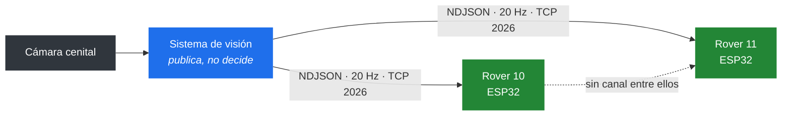
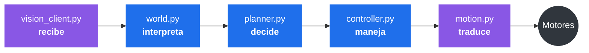
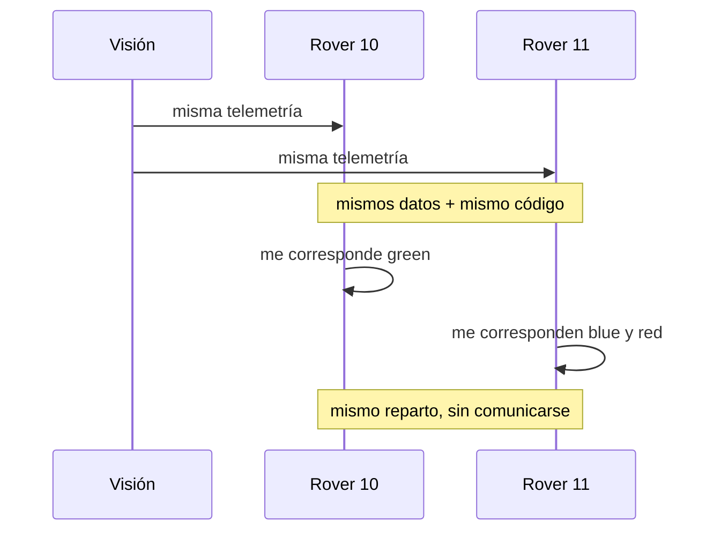
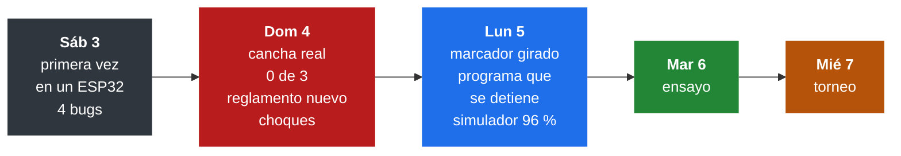

<div align="center">

# Vision Rover Challenge · EV4

**Dos rovers autónomos que reparten tres cubos en diez minutos, sin comunicarse entre sí y sin intervención humana.**

[](https://circuitpython.org)
[](https://crcibernetica.com)
[](https://python.org)


Reto de robótica colaborativa · Universidad CENFOTEC · Octubre 2026

</div>

---

## El problema

Una cámara cenital publica por TCP, veinte veces por segundo, la posición de cada rover y cada cubo. Los rovers reciben esa telemetría y deciden **a bordo**: el reglamento prohíbe que una computadora externa calcule rutas o envíe comandos durante la ronda.

Diez minutos. Tres cubos. Dos rovers que parten del mismo punto.



### Una ronda


Ningún operador interviene: cada robot lee la fase en la telemetría y arranca por sí mismo.

> **Regla 12.2.13:** cada rover debe empujar al menos un cubo. Si alguno no toca ninguno, los tres cubos no cuentan.

---

## Resultados

<table>
<tr><td width="50%" valign="top">

**Simulador** · 100 corridas

| Métrica | Valor |
|---|--:|
| Rondas con los 3 cubos | **96 %** |
| Tiempo mediano | 41 s |
| Peor caso | 79 s |
| Límite del reglamento | 600 s |
| Con la cámara fallando | **96 %** |
| Cubos lejos de su zona | 46 % |

</td><td width="50%" valign="top">

**Hardware** · ESP32

| Verificación | Estado |
|---|--:|
| Lazo de control | 22–24 Hz |
| Mensajes perdidos por lentitud | 0 |
| Arranque automático en `RUNNING` | Verificado |
| Quieto durante `READY` (regla 9.3) | Verificado |
| Recuperación tras caída de red | Verificado |
| Marcador girado 90° compensado | Verificado |
| El lazo sobrevive a un error | Pendiente en robot |

</td></tr>
</table>

**Verificado:** medido en el robot. **Pendiente en robot:** probado en la laptop, aún sin validar en hardware.

Cada cifra es trazable en **[`docs/MEDICIONES.md`](docs/MEDICIONES.md)**, junto con las hipótesis que se probaron, incluidas las que fallaron.

---

## Decisión de diseño principal

> **Solo dos archivos acceden al hardware.** El resto es lógica pura.



Los módulos morados acceden al hardware. **Los azules no importan nada de él**, por lo que se ejecutan igual en el ESP32 que en una laptop.

Esto es lo que habilita el simulador: [`sim/pista.py`](sim/pista.py) importa **los mismos módulos** que se cargan en el robot, no una maqueta aproximada. El 96 % del simulador describe, por tanto, el código que compite.

Se verificó contra el hardware:

| | Objetivo | Avance | Giro |
|---|---|---|---|
| Predicción en la laptop | `green` | `+0.450` | `+0.044` |
| Robot real | `green` | `+0.45` | `+0.05` |

---

## Coordinación sin comunicación

Los dos rovers **no se comunican**: no hay radio entre ellos, ni mensajes, ni negociación.



El reparto se resuelve por fuerza bruta minimizando el **makespan**: el instante en que termina el último rover, no la suma de tiempos. Como el algoritmo es determinista, ambos llegan al mismo resultado. Verificado con los dos robots ejecutándose a la vez:

```
ROVER 10 ·  reparto: 10 → ['green']          11 → ['blue', 'red']
ROVER 11 ·  reparto: 11 → ['blue', 'red']    10 → ['green']
```

Lo único que difiere entre los robots es `config.py`:

| | Rover 10 | Rover 11 |
|---|:-:|:-:|
| Si se cruzan | Sigue derecho | Se aparta |
| Salida | Al iniciar `RUNNING` | 3 s después |

Si uno desaparece de la cámara por más de 5 segundos, el otro asume todos los cubos.

<details>
<summary><b>¿Por qué makespan y no la suma?</b></summary>

<br>

La ronda termina cuando entra el **último** cubo. Un reparto de 100 s y 40 s pierde frente a uno de 75 s y 70 s, aunque este último implique más trabajo total: en el primero, un rover permanece detenido 60 segundos sin aportar.

Con 3 cubos y 2 rovers, las combinaciones de reparto y ordenamiento son una docena de casos. La fuerza bruta entrega el óptimo y cabe en un `for`. Un método húngaro daría la misma respuesta con diez veces más código.

</details>

---

## Máquina de estados de una entrega


Cada estado tiene asociado el color que muestra el LED del robot.

**Nunca se avanza directo al cubo.** Se va a un punto sobre la recta zona→cubo, unos centímetros por detrás. Ir directo empujaría el cubo en la dirección de llegada, que casi nunca es la correcta.

```
   [zona] ←───── [cubo] ←───── [punto de aproximación] ←───── [rover]
```

**El rover que termina no permanece donde entregó:** se desplaza a la esquina más alejada de los empujes que le faltan al compañero. Además, cada estado con movimiento tiene **timeout**: un rover trabado sin timeout consume la ronda completa empujando una pared.

---

## Indicador luminoso

En la cancha el robot opera sin cable. El LED es la única información que entrega.

| Color | Estado | Significado |
|:-:|---|---|
|  | n/a | **Problema:** sin telemetría o con un error. Motores frenados. También al encender, mientras se conecta |
|  | `IDLE` · `FINISHED` | Conectado, en espera |
|  | `READY` | Calculando, inmóvil por reglamento |
|  | `IR_APROX` | Desplazándose hacia un cubo |
|  | `ALINEAR` | Alineándose para empujar |
|  | `EMPUJAR` | Empujando |
|  | `RETROCEDER` · `VERIFICAR` | Retrocede y espera que el árbitro cuente el cubo |
|  | `APARTARSE` · `DESATASCAR` | Intermitente: maniobra de escape |
|  | `LISTO` | Fijo: terminó y se dirige a estacionarse |

**El rojo se reserva para problemas.** Un rojo que dura un instante y se corrige solo indica que el programa se recuperó de un error.

---

## Estructura

```
firmware/              ── código del robot
├── code.py               programa principal; CircuitPython lo ejecuta al encender
├── config_robot10.py     identidad y red · se sube como config.py
├── config_robot11.py     ídem para el otro robot · única diferencia entre ambos
├── world.py              traduce el JSON · geometría · desfase del marcador
├── planner.py            reparte los cubos · punto de aproximación · dónde estacionar
├── controller.py         máquina de estados · lazo de control
├── motion.py             convierte (avance, giro) en comandos a los dos motores
├── vision_client.py      wifi · socket TCP · buffer NDJSON
└── pruebas/              p1 … p7 · cada una aísla UNA pregunta

sim/pista.py           ── simulador de lazo cerrado (laptop)
tools/grabar.py        ── graba telemetría a .ndjson (laptop)
docs/MEDICIONES.md     ── todo lo medido, incluidos los fracasos
```

### Ejecutar el simulador

No requiere robot, cámara ni cancha.

```bash
python sim/pista.py                    # una corrida, con detalle
python sim/pista.py --n 100            # 100 corridas, estadísticas
python sim/pista.py --n 100 --camara mala
python sim/pista.py --n 30 --dificultad 0.8
```

---

## Bitácora



### Problemas encontrados y correcciones

| Problema | Causa | Corrección | Origen |
|---|---|---|:-:|
| Se trababan pegados entre ellos | El radio de esquiva (100 mm) era menor que la distancia a la que ya hay contacto (114 mm) | Radio de 180 mm; el que cede se aparta en lugar de frenar | Cancha |
| Se dirigían a cubos que la cámara no veía desde hacía 44 s | Nadie verificaba la antigüedad de los datos | Los datos viejos pasan al final de la fila | Cancha |
| Arrancaban en `READY` | El reglamento cambió: en `READY` hay que permanecer quieto | Calculan en quietud y arrancan en `RUNNING` | Reglamento |
| Un solo rover podía hacer los tres cubos | El reglamento cambió: ambos deben empujar | Ningún reparto deja a un rover sin cubos | Reglamento |
| Avanzaban de costado o daban vueltas | El marcador está pegado girado 90° | `DESFASE_MARCADOR` en `world.py` | Cancha |
| `MemoryError` al subir `controller.py` al rover 10 | 27 KB no caben en su placa | Se sube una copia sin comentarios, de 13 KB | Cancha |
| El rover 10 quieto durante toda la ronda | Su programa terminaba y nadie leía la telemetría | El lazo ya no puede terminar | Cancha |
| Empujaba contra un obstáculo hasta el timeout | El lazo no detecta que no hay avance | Si pide motor y no se mueve, retrocede girando | Simulador |
| El empuje se detenía 5 cm antes de la zona | La distancia al cubo se fijaba al inicio | Se actualiza mientras el cubo es visible | Simulador |
| El rover que terminaba estorbaba al otro | Se quedaba junto a la zona | Se estaciona en la esquina más lejana | Simulador |
| El segundo empuje sacaba el primer cubo | Pasaba por encima de su propia zona ocupada | El orden de los cubos evita esas pasadas | Simulador |

**Origen:** Cancha, observado en la cancha. Simulador, encontrado en el simulador. Reglamento, cambio del reglamento.

### El caso más costoso: el marcador girado

```
              lo que publica la cámara: 90°
                            ▲
                    ┌───────┼───────┐
                    │   ┌───┴───┐   █
                    │   │ ArUco │   █ ──▶  hacia donde empuja: 0°
                    │   └───────┘   █
                    └───────────────┘
                     vista superior      █ = paletas
```

La cámara informa el ángulo del **marcador**, no el de las paletas, y en ambos robots el marcador está pegado girado un cuarto de vuelta. El robot giraba hasta "apuntar" al cubo y avanzaba de costado.

En cuatro grabaciones, cada tramo recto iba unos 90° a la derecha de lo indicado por la cámara. Con la corrección, **47 de 51** tramos van hacia donde apunta el robot; antes, **0 de 51**. Si se despega y se vuelve a pegar un marcador, hay que medir de nuevo.

<details>
<summary><b>El programa que terminaba sin avisar</b></summary>

<br>

A las 10:22 del lunes, el robot 10 dejó de leer telemetría durante `IDLE` y permaneció así toda la ronda. La cámara lo veía, el sistema de visión descartaba el 100 % de sus mensajes, y el robot nunca se desconectó. Ocurre cuando el programa **termina** con la placa encendida: el socket queda abierto y nadie lo lee.

Ahora el lazo completo está protegido: ante un error, motores a cero, luz roja, limpieza de memoria y continuación. La causa exacta, muy probablemente falta de memoria, no está confirmada porque no había consola conectada.

</details>

<details>
<summary><b>Los cuatro bugs de la primera corrida en hardware</b></summary>

<br>

Ninguna cantidad de simulación los habría encontrado: solo existen en CircuitPython o con la red real.

**1. `math.hypot` no existe en CircuitPython.** `world.distancia()` la llamaba en cada ciclo. En la laptop funciona porque corre Python estándar; el error aparece en el robot, en el primer ciclo, y detiene todo.

**2. Un `_ir_a(X)` que no hace nada cuando ya se está en X.** Al vencerse un timeout, el cronómetro del estado no se reiniciaba. Volvía a vencer en el ciclo siguiente, 25 veces por segundo, y el robot quedaba **congelado el resto de la ronda**.

**3. Un socket cerrado que no se detecta.** Con timeout de 10 ms, `recv_into` levanta la misma excepción cuando el servidor cerró y cuando aún no hay datos. El robot estuvo **106 segundos** sin intentar reconectar. Ahora se guía por el silencio: tres segundos sin datos equivalen a sesenta mensajes perdidos.

**4. Una fuga de sockets, el caso más instructivo.** Cada conexión fallida dejaba un socket sin cerrar. A los pocos reintentos, `Out of sockets`, y la placa queda inutilizable hasta reiniciarla, algo que el reglamento prohíbe durante la ronda.

</details>

---

## Resultados negativos

Se documentan a propósito: hipótesis razonables que la medición desmintió.

| Hipótesis | Resultado |
|---|---|
| Cuantizar el costo del reparto | Salida **idéntica** hasta el decimal |
| Los postergados privados rompen la coordinación | **Falso.** Solo reordenan la mitad propia. Por este diagnóstico erróneo se llegó a plantear agregar ESP-NOW |
| Congelar el reparto | Elimina los arranques duplicados y recorta 70 s del peor caso, pero aun así **reduce** el éxito de 96 % a 93 % |
| Que el rover con prioridad también se aparte | **Reduce** de 90 % a 87 %: con los dos maniobrando, el que iba ganando cede terreno |
| Los rovers se trababan por patinar en el plástico | **Falso.** La grabación mostraba 1493 mm recorridos: se estaban **chocando entre ellos** |
| Los tramos "de costado" del domingo eran ruido | **Falso.** 21 de 24 iban de costado: era el marcador. Descartarlo costó un día |
| Un umbral fijo para detectar atascos | **Peor** que no tener detector con los cubos lejos (40 % contra 42 %): se disparaba 770 veces en 100 corridas |

El tercer caso es el más instructivo: los arranques duplicados resultaron ser **útiles**. Cuando ambos rovers llegan al mismo cubo, el segundo termina ayudando a empujarlo.

### El simulador sobreestimaba el desempeño

```
rondas con los 3 cubos · 100 corridas

los rovers se atravesaban como fantasmas   ████████████████████████▌  98 %
rovers sólidos                             ███████████████████        76 %
  + esquivarse y descartar datos viejos    ██████████████████████▌    90 %
marcador girado, como el de la cancha                                  0 %
  + corrección del marcador                ██████████████████████▌    90 %
  + arreglos del lunes                     ████████████████████████   96 %
```

Durante semanas el simulador marcó 98 % mientras la cancha daba 0 de 3. Fallaba en dos aspectos: los rovers **se atravesaban entre sí**, y publicaba el ángulo de las paletas, que es precisamente lo que la cámara no ve.

Con ambos aspectos modelados, el firmware que tenían los robots daba **0 %**: exactamente lo observado en la cancha. Desde ahí, cada punto de mejora mide algo que existe.

---

<div align="center">

CircuitPython 10 · ESP32 (IdeaBoard, CRCibernetica) · Python 3 · sin dependencias externas en el robot

</div>
