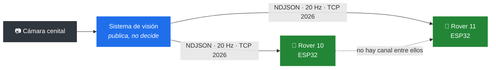
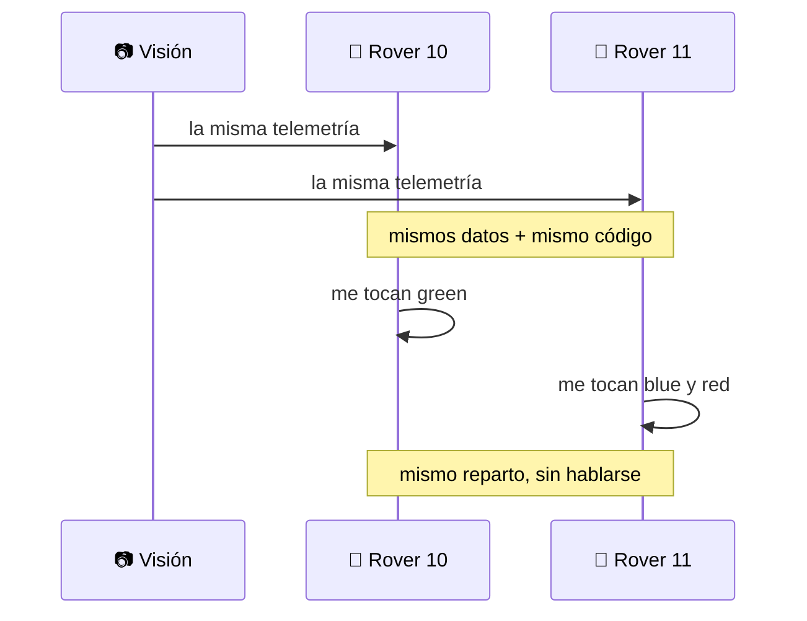
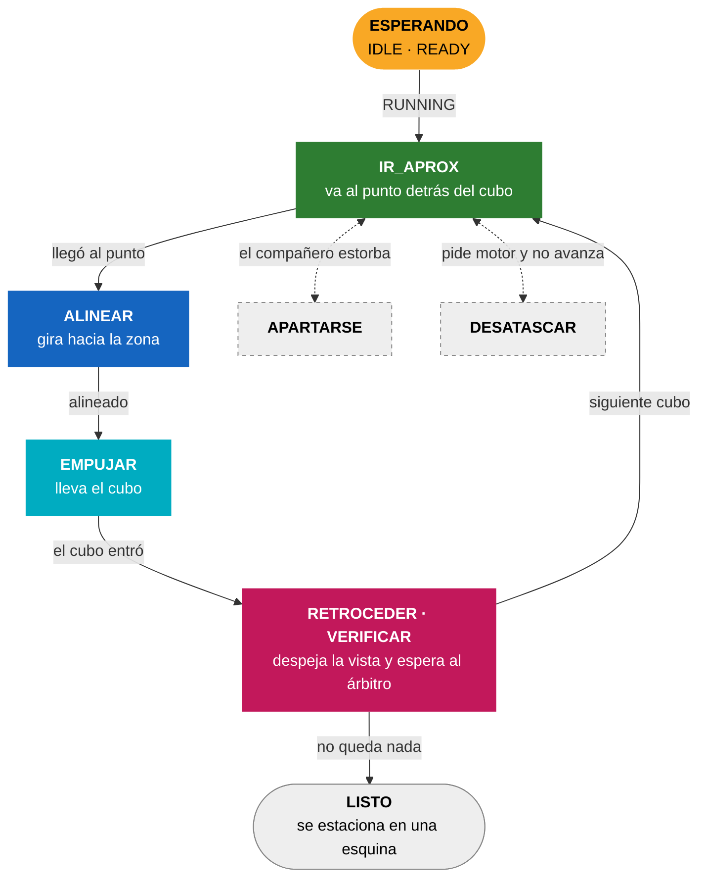
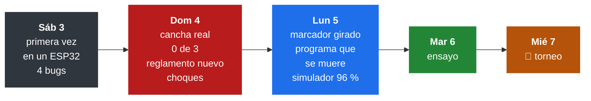

<div align="center">

# Vision Rover Challenge · EV4

**Dos rovers autónomos que reparten tres cubos en diez minutos — sin comunicarse entre sí y sin que nadie los toque.**

[](https://circuitpython.org)
[](https://crcibernetica.com)
[](https://python.org)


Reto de robótica colaborativa · Universidad CENFOTEC · Octubre 2026

</div>

---

## El problema

Una cámara cenital publica por TCP, veinte veces por segundo, dónde está cada rover y cada cubo. Los rovers escuchan y deciden **a bordo**: el reglamento prohíbe que una computadora externa calcule rutas o mande comandos durante la ronda.

Diez minutos. Tres cubos. Dos rovers que arrancan del mismo punto.



### Una ronda


Nadie aprieta un botón: cada robot ve la fase en la telemetría y arranca solo.

> **Regla 12.2.13:** cada rover tiene que empujar al menos un cubo. Si uno no toca ninguno, los tres no cuentan.

---

## Resultados

<table>
<tr><td width="50%" valign="top">

**Simulador** · 100 corridas

| | |
|---|--:|
| Rondas con los 3 cubos | **96 %** |
| Tiempo mediano | 41 s |
| Peor caso | 79 s |
| Límite del reglamento | 600 s |
| Con la cámara fallando | **96 %** |
| Cubos lejos de su zona | 46 % |

</td><td width="50%" valign="top">

**Hardware** · ESP32

| | |
|---|--:|
| Lazo de control | 22–24 Hz |
| Mensajes perdidos por lentitud | 0 |
| Arranque automático en `RUNNING` | ✅ |
| Quieto durante `READY` (regla 9.3) | ✅ |
| Recuperación tras caída de red | ✅ |
| Marcador girado 90° compensado | ✅ |
| El lazo sobrevive a un error | 🧪 |

</td></tr>
</table>

✅ medido en el robot · 🧪 probado en la laptop, falta en el robot

> Cada número es trazable en **[`docs/MEDICIONES.md`](docs/MEDICIONES.md)**, junto con las hipótesis que se probaron — **y las que fallaron**.

---

## La decisión de diseño que ordena todo

> **Solo dos archivos tocan hardware.** Todo lo demás es lógica pura.


Los morados tocan hardware. **Los azules no importan nada de él**, así que corren igual en el ESP32 que en una laptop.

Eso es lo que hace posible el simulador: [`sim/pista.py`](sim/pista.py) importa **los mismos módulos** que van al robot, no una maqueta parecida. Cuando el simulador dice 96 %, ese número habla del código que compite.

Y se verificó contra el hardware:

| | objetivo | avance | giro |
|---|---|---|---|
| Predicción en la laptop | `green` | `+0.450` | `+0.044` |
| Robot real | `green` | `+0.45` | `+0.05` |

---

## Coordinación sin comunicación

Los dos rovers **no se hablan**. No hay radio entre ellos, ni mensajes, ni negociación.



El reparto se resuelve por fuerza bruta minimizando el **makespan** — cuándo termina el que termina último, no la suma. Como el algoritmo es determinista, los dos llegan al mismo resultado. Verificado con los dos corriendo a la vez:

```
ROVER 10 ·  reparto: 10 → ['green']          11 → ['blue', 'red']
ROVER 11 ·  reparto: 11 → ['blue', 'red']    10 → ['green']
```

Lo único distinto entre los robots es `config.py`:

| | 🤖 Rover 10 | 🤖 Rover 11 |
|---|:-:|:-:|
| si se cruzan | sigue derecho | se aparta |
| sale | apenas empieza `RUNNING` | 3 s después |

Si uno desaparece de la cámara más de 5 segundos, el otro se queda con todos los cubos.

<details>
<summary><b>¿Por qué makespan y no la suma?</b></summary>

<br>

La ronda termina cuando entra el **último** cubo. Un reparto de 100 s y 40 s pierde contra uno de 75 s y 70 s, aunque este último haga más trabajo total: en el primero hay un rover parado 60 segundos sin sumar nada.

Con 3 cubos y 2 rovers hay 2³ repartos por sus ordenaciones — una docena de casos. La fuerza bruta da el óptimo y cabe en un `for`. Un método húngaro daría la misma respuesta con diez veces más código.

</details>

---

## La máquina de estados de una entrega



Cada estado tiene el color que muestra el LED del robot.

**Nunca se va directo al cubo.** Se va a un punto sobre la recta zona→cubo, unos centímetros por detrás. Yendo directo lo empujarías en la dirección en que venías, que casi nunca es la correcta.

```
   [zona] ←───── [cubo] ←───── [punto de aproximación] ←───── [rover]
```

**El que termina no se queda donde entregó**: se va a la esquina más alejada de los empujes que le faltan al compañero. Y cada estado con movimiento tiene **timeout**: un rover trabado sin timeout gasta la ronda entera empujando una pared.

---

## Las luces del robot

En la cancha el robot va sin cable. El LED es toda la información que da.

| luz | estado | qué significa |
|:-:|---|---|
|  | — | **problema**: sin telemetría o con un error. Motores frenados. También al encender, mientras se conecta |
|  | `IDLE` · `FINISHED` | conectado, esperando |
|  | `READY` | pensando, quieto a propósito |
|  | `IR_APROX` | yendo hacia un cubo |
|  | `ALINEAR` | alineándose para empujar |
|  | `EMPUJAR` | empujando |
|  | `RETROCEDER` · `VERIFICAR` | retrocede y espera que el árbitro cuente el cubo |
|  | `APARTARSE` · `DESATASCAR` | un momento: maniobra de escape |
|  | `LISTO` | fijo: terminó y se va a estacionar |

**El rojo es solo para problemas.** Un rojo que dura un instante y se va solo es el programa recuperándose de un error.

---

## Estructura

```
firmware/              ── el código del robot
├── code.py               el programa; CircuitPython lo corre al encender
├── config_robot10.py     identidad y red · se sube como config.py
├── config_robot11.py     ídem para el otro · lo único distinto entre los dos
├── world.py              traduce el JSON · geometría · desfase del marcador
├── planner.py            reparte los cubos · punto de aproximación · dónde estacionar
├── controller.py         máquina de estados · lazo de control
├── motion.py             de (avance, giro) a los dos motores
├── vision_client.py      wifi · socket TCP · buffer NDJSON
└── pruebas/              p1 … p7 · cada una aísla UNA pregunta

sim/pista.py           ── simulador de lazo cerrado (laptop)
tools/grabar.py        ── graba telemetría a .ndjson (laptop)
docs/MEDICIONES.md     ── todo lo medido, incluidos los fracasos
```

### Correr el simulador

No necesita robot, cámara ni cancha.

```bash
python sim/pista.py                    # una corrida, con detalle
python sim/pista.py --n 100            # 100 corridas, estadísticas
python sim/pista.py --n 100 --camara mala
python sim/pista.py --n 30 --dificultad 0.8
```

---

## Bitácora



### Lo que fue saliendo

| | qué pasaba | por qué | arreglo | |
|:-:|---|---|---|:-:|
| 💥 | se trababan pegados entre ellos | el radio para esquivarse (100 mm) era menor que la distancia a la que ya se tocan (114 mm) | radio de 180 mm, y el que cede se aparta en vez de frenar | 🏟️ |
| 👻 | iban hacia cubos que la cámara no veía hacía 44 s | nadie miraba la edad de los datos | lo viejo va al final de la fila | 🏟️ |
| 🛑 | arrancaban en `READY` | el reglamento cambió: en `READY` hay que quedarse quieto | piensan quietos, arrancan en `RUNNING` | 📜 |
| 🤝 | un solo rover podía hacer los tres cubos | el reglamento cambió: los dos tienen que empujar | ningún reparto deja a un rover sin cubos | 📜 |
| 🧭 | se iban de costado o daban vueltas | el marcador está pegado girado 90° | `DESFASE_MARCADOR` en `world.py` | 🏟️ |
| 📦 | `MemoryError` al subirle `controller.py` al 10 | 27 KB no le entran a su placa | se le sube una copia sin comentarios, de 13 KB | 🏟️ |
| 💀 | el 10, quieto toda la ronda | su programa terminaba y nadie leía la telemetría | el lazo ya no puede morirse | 🏟️ |
| 🧱 | empujaba contra algo hasta el timeout | el lazo no se entera de que no avanza | si pide motor y no se mueve, retrocede girando | 💻 |
| 📏 | el empuje frenaba 5 cm antes de la zona | la distancia al cubo se fijaba al empezar | se actualiza mientras se ve el cubo | 💻 |
| 🅿️ | el que terminaba estorbaba al otro | se quedaba al lado de la zona | se estaciona en la esquina más lejana | 💻 |
| 🔁 | el segundo empuje sacaba el primer cubo | pasaba por encima de su propia zona llena | el orden de los cubos evita esas pasadas | 💻 |

🏟️ visto en la cancha · 💻 encontrado en el simulador · 📜 cambio del reglamento

### El que más costó: el marcador girado

```
              lo que publica la cámara: 90°
                            ▲
                    ┌───────┼───────┐
                    │   ┌───┴───┐   █
                    │   │ ArUco │   █ ──▶  hacia donde empuja: 0°
                    │   └───────┘   █
                    └───────────────┘
                     vista de arriba      █ = paletas
```

La cámara informa el ángulo del **marcador**, no el de las paletas, y en los dos robots el marcador está pegado un cuarto de vuelta girado. El robot giraba hasta "apuntar" al cubo y avanzaba de costado.

En cuatro grabaciones, cada tramo recto iba unos 90° a la derecha de lo que decía la cámara. Con la corrección, **47 de 51** van hacia donde apunta; antes, **0 de 51**. Si alguien despega y vuelve a pegar un marcador, hay que medirlo de nuevo.

<details>
<summary><b>💀 El programa que se moría sin avisar</b></summary>

<br>

A las 10:22 del lunes el robot 10 dejó de leer telemetría en pleno IDLE y así quedó toda la ronda. La cámara lo veía, el sistema de visión descartaba el 100 % de sus mensajes, y el robot nunca se desconectó. Es lo que pasa cuando el programa **termina** con la placa prendida: el socket queda abierto y nadie lo lee.

Ahora el lazo entero está protegido: ante un error, motores a cero, luz roja, limpiar memoria y seguir. El porqué exacto —casi seguro, quedarse sin memoria— no está confirmado: no había consola conectada.

</details>

<details>
<summary><b>🔧 Los cuatro bugs de la primera corrida en hardware</b></summary>

<br>

Ninguna cantidad de simulación los habría encontrado: solo existen en CircuitPython o con la red real.

**1 · `math.hypot` no existe en CircuitPython.** `world.distancia()` la llamaba en cada ciclo. En la laptop funciona porque ahí corre Python normal: el error aparece recién en el robot, en el primer ciclo, y tumba todo.

**2 · Un `_ir_a(X)` que no hace nada cuando ya estás en X.** Al vencerse un timeout, el cronómetro del estado no se reiniciaba. Volvía a vencer al ciclo siguiente, 25 veces por segundo, y el robot quedaba **congelado el resto de la ronda**.

**3 · Un socket cerrado que no se detecta.** Con timeout de 10 ms, `recv_into` levanta la misma excepción cuando el servidor cerró y cuando todavía no hay datos. El robot estuvo **106 segundos** sin intentar reconectar. Ahora se guía por el silencio: tres segundos sin datos son sesenta mensajes perdidos.

**4 · Una fuga de sockets — el que más enseña.** Cada conexión fallida dejaba un socket sin cerrar. A los pocos reintentos, `Out of sockets`, y la placa queda muerta hasta reiniciarla, algo que el reglamento prohíbe durante la ronda.

</details>

---

## Resultados negativos

Documentados a propósito. Hipótesis razonables que la medición desmintió:

| Hipótesis | Resultado |
|---|---|
| Cuantizar el costo del reparto | Salida **idéntica** hasta el decimal |
| Los postergados privados rompen la coordinación | **Falso.** Solo reordenan la mitad propia. Se llegó a plantear agregar ESP-NOW por este diagnóstico equivocado |
| Congelar el reparto | Elimina los arranques duplicados y recorta 70 s del peor caso — y aun así **baja** el éxito de 96 % a 93 % |
| Que el rover con prioridad también se aparte | **Baja** de 90 % a 87 %: con los dos maniobrando, el que iba ganando cede terreno |
| Los rovers se trababan por patinar en el plástico | **Falso.** La grabación mostraba 1493 mm recorridos: se estaban **chocando entre ellos** |
| Los tramos "de costado" del domingo eran ruido | **Falso.** 21 de 24 iban de costado: era el marcador. Descartarlo costó un día |
| Un umbral fijo para detectar atascos | **Peor** que no tener detector con los cubos lejos (40 % contra 42 %): disparaba 770 veces en 100 corridas |

El tercero es el más instructivo: los arranques duplicados resultaron ser **útiles**. Cuando los dos rovers caen sobre el mismo cubo, el segundo termina ayudando a empujarlo.

### El simulador mentía

```
rondas con los 3 cubos · 100 corridas

los rovers se atravesaban como fantasmas   ████████████████████████▌  98 %
rovers sólidos                             ███████████████████        76 %
  + esquivarse y descartar datos viejos    ██████████████████████▌    90 %
marcador girado, como el de la cancha                                  0 %
  + corrección del marcador                ██████████████████████▌    90 %
  + arreglos del lunes                     ████████████████████████   96 %
```

Durante semanas marcó 98 % mientras la cancha daba 0 de 3. Mentía dos veces: los rovers **se atravesaban como fantasmas**, y publicaba el ángulo de las paletas, que es justo lo que la cámara no ve.

Con las dos cosas modeladas, el firmware que tenían los robots daba **0 %**: exactamente lo que daba la cancha. Desde ahí, cada punto que subió mide algo que existe.

---

<div align="center">

CircuitPython 10 · ESP32 (IdeaBoard, CRCibernetica) · Python 3 · sin dependencias externas en el robot

</div>
