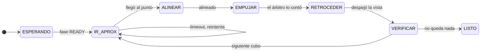

<div align="center">

# Vision Rover Challenge · EV4

**Dos rovers autónomos que reparten tres cubos en diez minutos — sin comunicarse entre sí y sin que nadie los toque.**

[](https://circuitpython.org)
[](https://crcibernetica.com)
[](https://python.org)


Reto de robótica colaborativa · Universidad CENFOTEC · Octubre 2026

</div>

---

## El problema

Una cámara cenital publica por TCP, veinte veces por segundo, dónde está cada rover y cada cubo. Los rovers escuchan y deciden **a bordo**: el reglamento prohíbe que una computadora externa calcule rutas o mande comandos durante la ronda.

Diez minutos. Tres cubos. Dos rovers que arrancan del mismo punto.


---

## Resultados

<table>
<tr><td width="50%" valign="top">

**Simulador** · 100 corridas

| | |
|---|--:|
| Rondas con los 3 cubos | **98 %** |
| Tiempo mediano | 185 s |
| Peor caso | 384 s |
| Límite del reglamento | 600 s |

</td><td width="50%" valign="top">

**Hardware** · ESP32

| | |
|---|--:|
| Lazo de control | 22–24 Hz |
| Mensajes perdidos por lentitud | 0 |
| Arranque automático en `READY` | ✅ |
| Recuperación tras caída de red | ✅ |

</td></tr>
</table>

> Cada número es trazable en **[`docs/MEDICIONES.md`](docs/MEDICIONES.md)**, junto con las hipótesis que se probaron — **y las que fallaron**.

---

## La decisión de diseño que ordena todo

> **Solo dos archivos tocan hardware.** Todo lo demás es lógica pura.


Los morados tocan hardware. **Los azules no importan nada de él**, así que corren igual en el ESP32 que en una laptop.

Eso es lo que hace posible el simulador: [`sim/pista.py`](sim/pista.py) importa **los mismos módulos** que van al robot, no una maqueta parecida. Cuando el simulador dice 98 %, ese número habla del código que compite.

Y se verificó contra el hardware:

| | objetivo | avance | giro |
|---|---|---|---|
| Predicción en la laptop | `green` | `+0.450` | `+0.044` |
| Robot real | `green` | `+0.45` | `+0.05` |

---

## Coordinación sin comunicación

Los dos rovers **no se hablan**. No hay radio entre ellos, ni mensajes, ni negociación.

Reciben la misma telemetría y corren el mismo código. El reparto se resuelve por fuerza bruta minimizando el **makespan** — cuándo termina el que termina último, no la suma — y como el algoritmo es determinista, los dos llegan al mismo resultado. Después cada uno lee qué le tocó a sí mismo.

Lo único distinto entre los robots es `config.py`: quién soy, quién es el otro, si cedo el paso, cuánto espero antes de salir.

Verificado con los dos corriendo a la vez:

```
ROVER 10 ·  reparto: 10 → ['green']          11 → ['blue', 'red']
ROVER 11 ·  reparto: 11 → ['blue', 'red']    10 → ['green']
```

<details>
<summary><b>¿Por qué makespan y no la suma?</b></summary>

<br>

La ronda termina cuando entra el **último** cubo. Un reparto de 100 s y 40 s pierde contra uno de 75 s y 70 s, aunque este último haga más trabajo total: en el primero hay un rover parado 60 segundos sin sumar nada.

Con 3 cubos y 2 rovers hay 2³ repartos por sus ordenaciones — una docena de casos. La fuerza bruta da el óptimo y cabe en un `for`. Un método húngaro daría la misma respuesta con diez veces más código.

</details>

---

## La máquina de estados de una entrega



**Nunca se va directo al cubo.** Se va a un punto sobre la recta zona→cubo, unos centímetros por detrás. Yendo directo lo empujarías en la dirección en que venías, que casi nunca es la correcta.

```
   [zona] ←───── [cubo] ←───── [punto de aproximación] ←───── [rover]
```

Cada estado con movimiento tiene **timeout**. Un rover trabado sin timeout gasta la ronda entera empujando una pared.

---

## Estructura

```
firmware/              ── va al robot
├── code.py               el programa; CircuitPython lo corre al encender
├── config.py             identidad y calibración · lo único distinto entre los dos
├── world.py              traduce el JSON · geometría
├── planner.py            reparte los cubos · punto de aproximación
├── controller.py         máquina de estados · lazo de control
├── motion.py             de (avance, giro) a los dos motores
├── vision_client.py      wifi · socket TCP · buffer NDJSON
└── pruebas/              p1 … p7 · cada una aísla UNA pregunta

sim/pista.py           ── simulador de lazo cerrado (laptop)
tools/grabar.py        ── graba telemetría a .ndjson (laptop)
docs/MEDICIONES.md     ── todo lo medido, incluidos los fracasos
```

### Correr el simulador

No necesita robot, cámara ni cancha.

```bash
python sim/pista.py                 # una corrida, con detalle
python sim/pista.py --n 100         # 100 corridas, estadísticas
python sim/pista.py --n 30 --dificultad 0.8
```

---

## Lo que enseñó la primera corrida en hardware

Cuatro bugs que **ninguna cantidad de simulación** habría encontrado, porque solo existen en CircuitPython o con la red real.

<details open>
<summary><b>1 · <code>math.hypot</code> no existe en CircuitPython</b></summary>

<br>

`world.distancia()` la llamaba en cada ciclo. En la laptop funciona porque ahí corre Python normal — el error aparece recién en el robot, en el primer ciclo, y tumba todo.

</details>

<details>
<summary><b>2 · Un <code>_ir_a(X)</code> que no hace nada cuando ya estás en X</b></summary>

<br>

Al vencerse un timeout, el cronómetro del estado no se reiniciaba. Volvía a vencer al ciclo siguiente, y al siguiente, 25 veces por segundo, devolviendo `(0, 0)`.

El robot quedaba **congelado el resto de la ronda**. Arreglarlo también subió el simulador de 96 % a 98 %.

</details>

<details>
<summary><b>3 · Un socket cerrado que no se detecta</b></summary>

<br>

Con timeout de 10 ms, `recv_into` levanta la misma excepción cuando el servidor cerró y cuando todavía no hay datos. Indistinguibles desde el código.

El robot estuvo **106 segundos** sin intentar reconectar. Ahora se guía por el silencio: a 20 Hz, tres segundos sin datos son sesenta mensajes perdidos — eso no es una pausa, es una conexión muerta.

</details>

<details>
<summary><b>4 · Una fuga de sockets</b> — el que más enseña</summary>

<br>

Cada conexión fallida dejaba un socket sin cerrar. El ESP32 tiene cuatro u ocho: a los pocos reintentos, `Out of sockets`, y la placa queda muerta hasta reiniciarla — algo que el reglamento prohíbe durante la ronda.

Habría costado el intento entero en el escenario más probable: que el sistema de visión tardara unos segundos más en levantar que lo que el robot aguantaba reintentando.

</details>

---

## Resultados negativos

Documentados a propósito. Tres hipótesis razonables que la medición desmintió:

| Hipótesis | Resultado |
|---|---|
| Cuantizar el costo del reparto | Salida **idéntica** hasta el decimal |
| Los postergados privados rompen la coordinación | **Falso.** Solo reordenan la mitad propia. Se llegó a plantear agregar ESP-NOW basándose en este diagnóstico equivocado |
| Congelar el reparto | Elimina el 100 % de los arranques duplicados y recorta 70 s del peor caso — y aun así **baja** el éxito de 96 % a 93 % |

El tercero es el más instructivo: los arranques duplicados resultaron ser **útiles**. Cuando los dos rovers caen sobre el mismo cubo, el segundo termina ayudando a empujarlo.

---

<div align="center">

CircuitPython 10 · ESP32 (IdeaBoard, CRCibernetica) · Python 3 · sin dependencias externas en el robot

</div>
